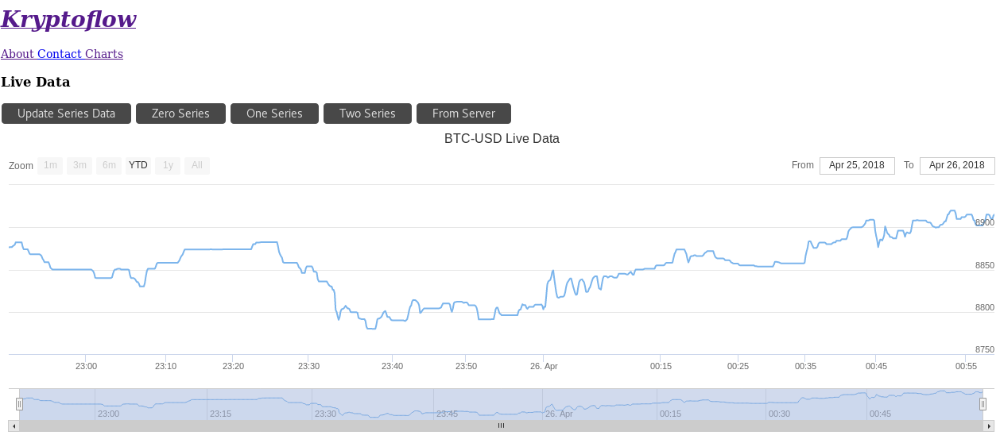
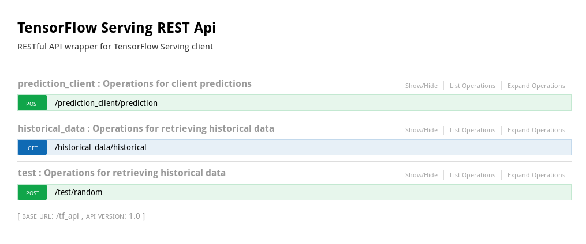

Kryptoflow
==========

[](https://gitter.im/kryptoflow-repo/Lobby?utm_source=badge&utm_medium=badge&utm_campaign=pr-badge&utm_content=badge)
[](https://travis-ci.org/carlomazzaferro/kryptoflow)


Algorithmic crypto trading framework with Kafka and TensorFlow ([Keras](https://keras.io/) + [TensorFlow Serving](https://www.tensorflow.org/serving/))

Documentation live at: https://carlomazzaferro.github.io/kryptoflow/index.html

Description
===========

Implemented so far:

1. Data ingestion pipeline, which includes websocket streams from twitter, reddit, gdax which are saved to three separate Kafka topics.
2. Data transforms to model gdax (BTC-USD only for now) into time-series of custom timespan to which RNNs/LSTMs can be applied for time-series prediction
3. Tensorflow training and model persistance
4. Tensorflow Serving APIs exposed through a Flask endpoint. A few details are worth mentioning here. The Tensorflow Serving is actually run within a docker container, and that docker container is polled by a Flask endpoint through gRPC.

Installation and Infrastructure
===============================
## Infrastructure: kafka, tensorflow, et. al.

Spin up kafka and related scrapers (zookeeper, kafka-ui, etc.)

```bash
docker-compose up
```

## Data collection, without Docker (MacOS, Ubuntu)

First, create a new virtual environment. This is highly recommended for managing dependencies.

Then, modify the `resources/resources.json` file, and add your twitter and reddit API keys. This will enable you to programmatically access the twitter and Reddit APIs.

### Dependencies

1. python3.6 (recommend installing with homebrew)
2. librdkafka: `brew install librdkafka`
3. Python requirements: `pip install -r requirements.txt`
4. NLTK requirements: `python3.6 -c "import nltk; nltk.download('vader_lexicon'); nltk.download('punkt')"`
4. Local install: `pip install -e .`
5. Kafka IP: `export KAFKA_SERVER_IP='kafka1'`

Finally, you may need to edit your `/etc/hosts/` to be able to connect to kafka. Do so by running:

`sudo nano /etc/hosts`

and adding the following line to it:

`127.0.0.1       localhost kafka1`

### Run scrapers

Then, run `mkdir -p ~/tmp/logs/ && supervisord -c resources/supervisord.conf`

This will run the three scripts below and will take care of restarting them if/when they fail. This should happen eventually due to API downtimes, malformatted data that is not handled, etc. Usually however the scripts are pretty resiliant and have run for weeks straight.

Alternatively, run:

`python3.6 kryptoflow/scrapers/reddit.py`

`python3.6 kryptoflow/scrapers/gdax_ws.py`

`python3.6 kryptoflow/scrapers/twitter.py`

To verify that your data is being ingested appropriatley, head to [http://localhost:8000](http://localhost:8000) for a visual ui of the Kafka
topics being ingested.

## Webapp

The scope of the project is creating a _framework_. As such, I found it tremendously useful (and a great learning
experience) to add a visualization layer that would make it easy to visualize the collected data, as well as 
the performance of the models. A bare-bones (note: still in development) ember.js can be accessed by running:

`python -m kryptoflow.serving.app.py -vv`

Then, head to  [http://localhost:5000](http://0.0.0.0:5000) and click on 'Charts'. To retrieve historical
data, click on 'From Server'.

This should show up: 




## API

The backend was written in Flask. It provides restful access to historical data as well as access to the prediction
service. The latter should work only if the steps outlined in the Analysis section have been followed. The api was 
built with [Flask-RESTPLUS](http://flask-restplus.readthedocs.io/en/stable/), which offers automated documentation
with swagger. 

Head to [http://0.0.0.0:5000/tf_api/#!/historical_data](http://0.0.0.0:5000/tf_api/#!/historical_data) to check it out. 

Preview:



##  Analysis
Check out Keras [training notebook](https://github.com/carlomazzaferro/kryptoflow/blob/master/keras_training.ipynb)
for training and model storing instructions

## Deploy with Tensorflow Serving

Build the docker container with bazel, tf serving, and all the required dependencies to
serve the model. This may take some time (~40 minutes)

```bash
bash kryptoflow/serving/build_server.sh
```

Then, copy the stored models to the container:

```bash
bash kryptoflow/serving/serve.sh 1
```

The `1` indicates the number of the model. Check `saved_models/` directory for the available
stored models. These are automatically saved when the class `kryptoflow.ml.export.ModelExporter` is
instantiated. See the notebook for more info on how to stored the models themselves.


## License

[GNU General Public License v3.0](https://choosealicense.com/licenses/gpl-3.0/)


