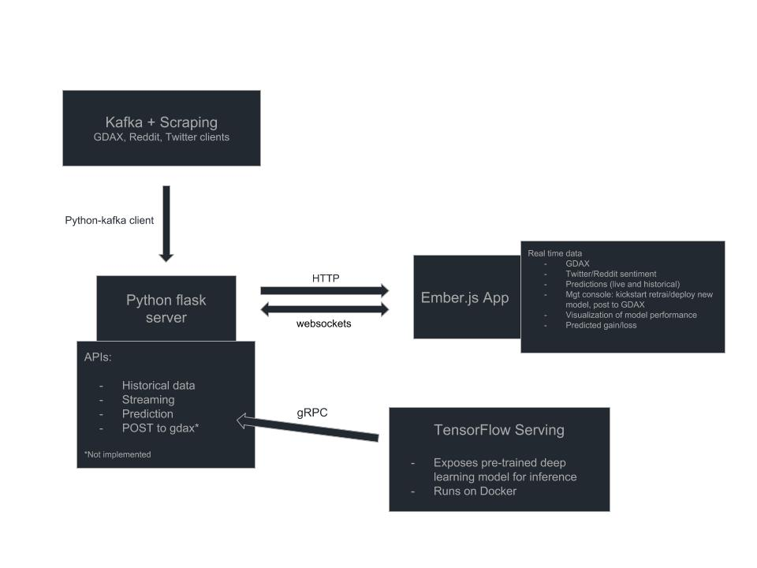

### Overview

This diagram shows how the project pieces are wired together:

### Scrapers

In python, ideally you'd run these on a remote server:

- GDAX client 
- Reddit client 
- Twitter client 

All continuously collecting data and put into Kafka, managed by supervisord.

### Python/Flask Server

Serves APIs to interact with:

- Kafka
- Frontend 
- TensorFlow serving

Tensorflow serving is this really neat project by Google that lets you bundle up a 
pre-trained model, compile it into a large binary, and deploy it inside a Docker 
container. It also provides functionality to version your models and continuously 
deploy them.

### Frontend

Ember Application → So far only one feature is implemented: a chart of historical 
data fro GDAX. This data is fetched by calling the API from Flask, which connects to
Kafka and gathers it. Despite the 2 hops it needs to make 
(frontend → Flask → Kafka → Flask → Frontend), it is quite fast and mostly depends on 
internet connectivity (reads from kafka are blazing fast). 
 
Another feature recenlty implemented is the ability to display live incoming data through
websockets. 

